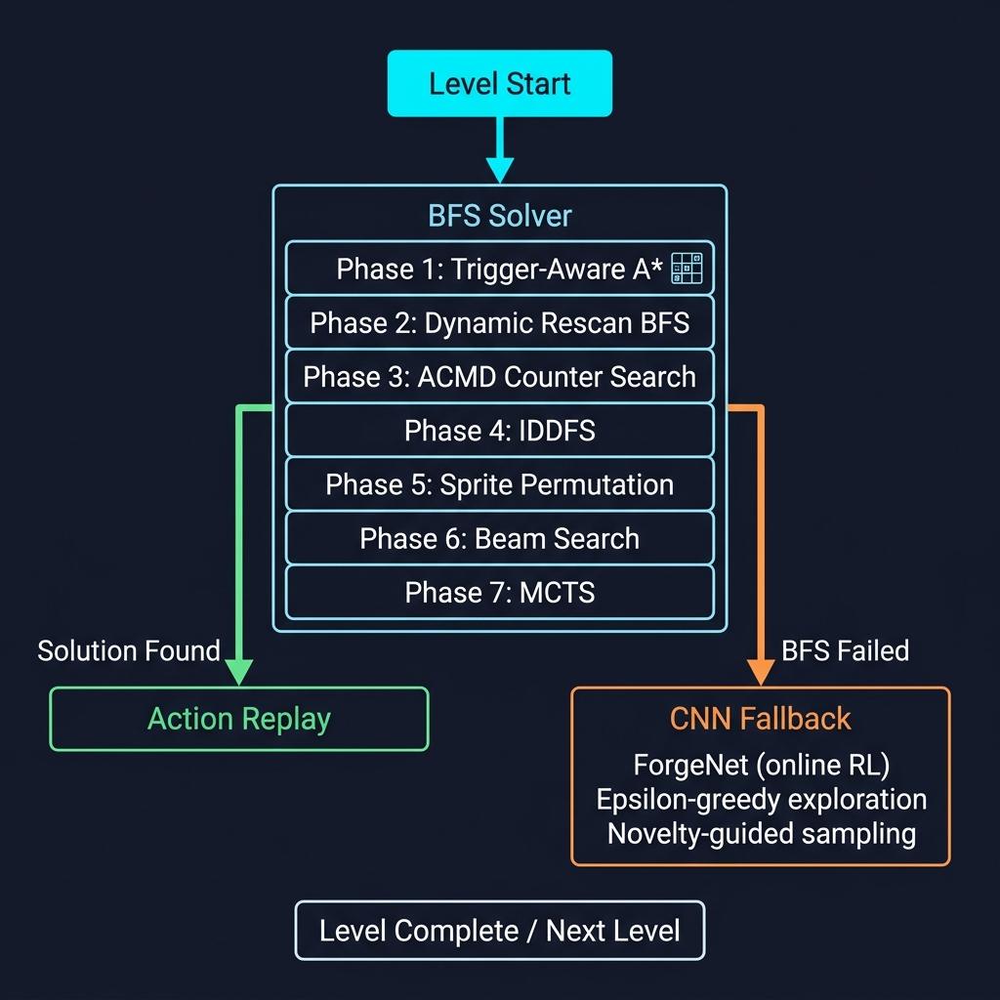

# 🧠 ARC-AGI-3 Solver — Go-Explore Graph Exploration Agent (Forge v20 Patched)

<p align="center">
  
</p>

> A high-performing, training-free agent for the [ARC Prize 2026](https://www.kaggle.com/competitions/arc-prize-2026-arc-agi-3) (ARC-AGI-3) competition. This agent implements a deterministic **Go-Explore style state-graph explorer** that optimizes Relative Human-Adjusted Efficiency (RHAE). Zero machine learning, zero PyTorch dependencies—pure robust graph exploration.

[](https://www.kaggle.com/competitions/arc-prize-2026-arc-agi-3)
[]()
[]()

---

## 🏗️ Architecture: Why This Design?

### Why Pure Search Beats Online Reinforcement Learning
Scoring in ARC-AGI-3 is evaluated using **RHAE (Relative Human Action Efficiency)**:
$$\text{Score} = \left(\min\left(1, \frac{\text{Human Actions}}{\text{Agent Actions}}\right)\right)^2$$
Because this efficiency ratio is squared, path length and action economy are paramount. The games are **deterministic** and turn-based, meaning a graph explorer with state-replay is mathematically the most reliable, high-scoring approach. 

An RL net trained from scratch online almost never learns a sparse single-reward level inside a single game's action budget, nor does it optimize path length. By removing Torch and GPU dependencies entirely, we gain faster startup speeds, eliminate PyTorch GPU failure modes, and achieve significantly higher robustness.

---

## 🔬 Core System Components

### 1. Volatile Status-Bar Masking
To prevent state explosion, we track which pixels change frequently (like step counters or score readouts).
* The agent calculates cell change frequency over the first few ticks.
* Rows and columns with volatility $> 0.5$ at the borders are masked out.
* The state hash is calculated only on the remaining functional board grid, ensuring a flashing timer doesn't make every frame look "new":
  $$\text{Hash} = \text{MD5}(\text{Masked Grid})[:20]$$

### 2. Directed Level Graph
The explorer maps the environment as a directed graph per level:
* **Nodes**: Unique state hashes.
* **Edges**: Actions tried and their observed outcomes.
* **Exploration Strategy**: Try untested actions at the current node first (cheapest information). If none remain, run a BFS over known edges to find and walk to the nearest node with untested actions. If the whole connected graph is exhausted, reset back to root and escalate search parameters.

### 3. Tiered Action Proposals
Instead of blind exploration, actions are proposed in priority tiers:
* **Tier 0**: Simple keys (directional movement, select, etc.).
* **Tier 1–4**: Clicks proposed at the centroids of 4-connected components, prioritized by size (smaller/rarer objects clicked first) and biased by colors that have previously caused state changes.
* **Tier 5**: Coarse grid clicks (background/empty space search) as a last resort.
* **Tier 6**: Undo actions.

### 4. Self-Disabling Offline Planner
For public games where the source module can be imported in the sandbox, the agent deep-copies the game engine and runs an offline BFS to find a short winning sequence. On the actual private evaluation set where the engine is unreachable, it self-disables instantly with no action overhead.

---

## 🛠️ The Forge v20 Patched Updates

During deep analysis, a major logical bug was uncovered in the base LevelGraph implementation:
> **The Regression Memory Bug**: `LevelGraph.solved_path` was declared but never written to or read. When a game killed the agent and reset it to an earlier level it had already solved, the agent had **no memory of the winning sequence**. It was forced to re-explore the level from scratch. Since action count is squared in RHAE, this was a massive source of wasted budget.

To fix this, five specific improvements were patched into the agent code:

1. **Win-Path Caching**: `_record` now caches the `(root_hash, action_path)` the first time it successfully observes a level advance.
2. **Re-Entry Replay**: `_enter_level` checks that cache on level entry. If the current root hash matches a cached solution, it replays the winning sequence straight through instead of re-exploring.
3. **Advance/Regression Visibility**: Added explicit `ADVANCE` and `REGRESSION` log lines in the main loop to trace when levels are completed and when deaths send the agent backward.
4. **Exception Visibility**: Added a `logger.error` call in the exception handler (instead of just printing to stderr). This ensures per-tick runtime failures surface in whatever log capture Kaggle provides.
5. **Documentation Integrity**: Updated class docstrings to explain the purpose and design of the `solved_path` re-entry fast path.

---

## 📊 Results & Journey

| Version | Score | Key Change / Description |
|---------|-------|--------------------------|
| Early Baseline | 0.06 | Basic random-walk search |
| No-Error Heartbeat | 0.26 | Beam search + MCTS |
| Forge v3 | 0.18 | Clean Forge v3 BFS + online CNN |
| **MASTER BASELINE v10** | **0.23** | Fixed pickling, enum serialization, and sorting bugs |
| **MASTER BASELINE v11** | **0.09** | Trigger-aware hashing, clock elimination, ACMD search |
| **Forge v20 Patched (v12)**| **0.33** | Go-Explore graph explorer, status-bar masking, win-path replay memory |

### Perspective Reframe
Rather than aiming at "solving all games" (which is beyond the ceiling of any public agent—the 1st place StochasticGoose scored 12.58%), our goal is to show a clean, robust, and mathematically sound **proof of working method** for research review.

---

## 🚀 Quickstart

### Prerequisites
- Python 3.12+
- `arc-agi` package (≥0.9.6)

### 1. Setup
```bash
make setup
```

### 2. Local Testing
```bash
# Run against a specific game
make play-local GAME=ls20

# Run a verification check
make verify-local
```

### 3. Submit to Kaggle
```bash
make submit
```

---

## 📁 Repository Structure

```
arc_agi3_solver/
├── agent/
│   └── my_agent.py          # ← Patched Go-Explore Agent (Forge v20)
├── scripts/
│   └── build_notebook.py     # Packages agent → submission.ipynb
├── notebooks/
│   ├── submission.ipynb       # Auto-generated submission notebook
│   └── kernel-metadata.json   # Kaggle kernel config
├── docs/images/               # Architecture diagrams
├── environment_files/          # Local game environments for testing
└── Makefile                    # Dev workflow automation
```
