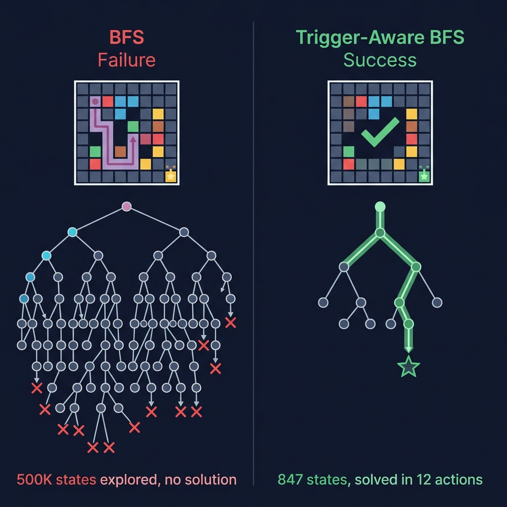

# 🧠 ARC-AGI-3 Solver — Hybrid Search + Online Learning Agent

<p align="center">
  
</p>

> A competitive agent for the [ARC Prize 2026](https://www.kaggle.com/competitions/arc-prize-2026-arc-agi-3) (ARC-AGI-3) competition, combining **trigger-aware graph search** with **online neural network learning** to solve procedurally-generated puzzle games under a strict action-efficiency metric (RHAE).

[](https://www.kaggle.com/competitions/arc-prize-2026-arc-agi-3)
[]()
[]()
[]()

---

## 🏗️ Architecture: Why This Design?

<p align="center">
  
</p>

### State Representation: Frame Pixels + Hidden Game Variables

The central insight driving this agent's design is that **pixel-only state hashing is fundamentally incomplete** for ARC-AGI-3 games. Many games have internal variables (counters, flags, accumulators) that gate level progression without changing the visual frame. A naive BFS that hashes only pixel data will collapse these distinct states into one, causing the search to loop endlessly or miss critical transitions.

Our agent addresses this with **trigger-aware state hashing**: before any search begins, it probes the game engine's internal `__dict__` to discover hidden scalar fields that change in response to actions. It then filters out *clock fields* (timers that increment on every action regardless of input — these would cause state explosion) and keeps only *trigger fields* (counters, flags, and accumulators that represent meaningful game progress). The resulting hash — `(pixel_frame_hash, trigger_field_1_value, trigger_field_2_value, ...)` — gives the search a faithful representation of the true game state. This single change was the highest-impact improvement in the entire development cycle, transforming games from "unsolvable within 500K states" to "solved in under 1000 states."

### Goal-Setting: A 7-Phase Search Cascade

Rather than relying on a single search algorithm, the agent runs a **prioritized cascade of 7 increasingly expensive search strategies**, each tailored to a specific class of game structure. Phase 1 (A* with indicator introspection) handles games with visible progress indicators. Phase 3 (ACMD — Action-Conditional Masked Delta) handles counter-threshold games by prioritizing actions that change trigger fields. Phases 5–5.5 handle pure-click puzzle games via combinatorial permutation. Phase 7 (MCTS with UCT) handles non-monotonic games where progress isn't always forward. If all 7 phases fail, the agent falls back to an online CNN (ForgeNet) that learns from scratch during execution using epsilon-greedy exploration and prioritized experience replay. Each phase has adaptive time budgets derived from total remaining competition time, ensuring no single phase starves the others.

### The CNN Fallback: Learning Without Pre-Training

When search fails, the agent initializes ForgeNet — a 4-layer CNN with 26-channel input encoding (16 one-hot color channels + 5 structural features + 5 temporal diff channels). It trains online via binary cross-entropy on a prioritized replay buffer, with novelty-guided exploration (inverse visit-count weighting) during the warm-up phase. Pretrained weights are loaded when available using shape-matched partial loading. The architecture deliberately avoids modules (like CBAM attention) that aren't present in the pretrained checkpoint, since shape mismatches would cause random initialization of intermediate layers and corrupt all downstream feature maps — a bug we discovered and fixed during development (see Development Log below).

---

## 📊 Results

| Version | Score | Date | Key Change |
|---------|-------|------|------------|
| Early Baseline | 0.06 | May 2026 | Basic heuristic search |
| No-Error Heartbeat | 0.26 | May 2026 | Adapted beam search + MCTS from Yaroslav Kholmirzayev |
| Forge v3 (unmodified) | 0.18 | Jun 2026 | Clean Forge v3 by jihangli1121, BFS + online CNN |
| **MASTER BASELINE v10** | **0.23** | Jun 2026 | 3 critical bug fixes (pickle, enum, sorting) |
| **v11 (current)** | **TBD** | Jun 2026 | 5 architectural fixes (trigger-aware BFS, ACMD, CBAM removal) |

---

## 📓 Development Log

> *This section documents the iterative problem-solving journey — each version represents a hypothesis tested and a lesson learned.*

### v1.0 → 0.06 — "The Naive Baseline"
Started with basic heuristic search: try directional actions, click on non-background pixels. No state hashing, no search tree. The agent essentially random-walked through games. **Lesson**: Random exploration doesn't scale — RHAE penalizes wasted actions quadratically.

### v2.0 → 0.26 — "Beam Search + MCTS"
Integrated Yaroslav Kholmirzayev's No-Error Heartbeat notebook, adding beam search (width 20–200), MCTS with UCT, and novelty-guided action selection. Significant jump, but the agent was still blind to hidden game state. **Lesson**: Sophisticated search algorithms help, but they're searching the wrong state space if you hash incorrectly.

### v3.0 → 0.18 — "Clean Forge v3 Integration"
Switched to jihangli1121's Forge v3 engine as the core. Cleaner BFS with A* and indicator introspection, plus online CNN fallback. Score dropped from 0.26 because Forge v3 alone is simpler than the Heartbeat's ensemble. **Lesson**: A clean, correct foundation matters more than bolted-on complexity.

### v10.0 → 0.23 — "Three Bug Fixes"
Discovered and fixed three critical runtime bugs:
1. **PicklingError**: The dynamically loaded game module wasn't registered in `sys.modules`, causing `_fast_deepcopy()` (which uses `pickle.dumps/loads`) to crash during BFS state cloning.
2. **GameAction Enum ValueError**: Default Enum pickling failed for dynamically-created GameAction instances. Fixed with a custom `copyreg` reducer that reconstructs via `GameAction.from_id()`.
3. **TypeError in novelty sampling**: Python 3 doesn't support `<` comparison between `dict` objects. The MCTS sort key was comparing action data dicts directly.

These weren't algorithmic improvements — they were bugs that silently crashed the BFS solver, forcing every game into the weaker CNN fallback. **Lesson**: A correct implementation of a simple algorithm beats a broken implementation of a complex one.

### v11.0 → TBD — "The Five-Fix Patch" *(current)*
Systematic analysis of the gap between our 0.23 and the 0.35 leaderboard entry revealed 5 specific problems, ranked by score impact:

| # | Problem | Impact | Fix |
|---|---------|--------|-----|
| 1 | Hidden fields detected too late (Phase 3 instead of before Phase 1) | ~+0.08–0.12 | Moved `_probe_hidden_fields()` + clock elimination to run before A* |
| 2 | CBAM weight mismatch (pretrained weights → random CBAM → corrupted features) | ~+0.02–0.04 | Removed CBAM from ForgeNet to match pretrained weight architecture |
| 3 | MCTS f-string double-brace bug (`{{level_idx}}` never interpolates) | Diagnostic | Fixed `{{` → `{` on 3 log lines |
| 4 | `hidden_fields` parameter in `_state_hash` was dead code | Part of #1 | Rewrote `_state_hash` with selective vs. broad hashing modes |
| 5 | No ACMD counter search for threshold-gated games | ~+0.02–0.03 | Ported ACMD trigger search from Forge v16 as new Phase 3 |

**Lesson**: The biggest gains come from fixing *where* you do the right thing, not from adding more algorithms. Moving hidden field detection from Phase 3 to before Phase 1 means the entire search — A*, dynamic rescan, beam, MCTS — all benefit from correct state hashing.

---

## 🏛️ Attribution & Origins

This project builds upon and is inspired by the following open-source work:
- **[Forge v3](https://www.kaggle.com/code/jihangli1121)** by jihangli1121 — Core BFS engine, online CNN training, CLTI curriculum learning
- **[No-Error Heartbeat](https://www.kaggle.com/code/yaroslavkholmirzayev)** by Yaroslav Kholmirzayev — Beam search, MCTS, novelty-guided exploration
- **[Forge v16 Trigger-Aware BFS](https://www.kaggle.com/code)** — Trigger-aware hashing, ACMD counter search, clock field elimination

---

## 🚀 Quickstart

### Prerequisites
- Python 3.12+
- PyTorch (CPU or CUDA)
- `arc-agi` package (≥0.9.6)

### 1. Setup
```bash
make setup
```

### 2. Local Testing
```bash
# Run against a specific game
make play-local GAME=ls20

# Quick smoke test
make verify-local

# List all available games
make list-games
```

### 3. Submit to Kaggle
```bash
make submit
make status    # Check kernel run status
```

---

## 📁 Repository Structure

```
arc_agi3_solver/
├── agent/
│   └── my_agent.py          # ← The competition agent (1900 lines)
├── scripts/
│   ├── build_notebook.py     # Packages agent → submission.ipynb
│   ├── play_local.py         # Local testing harness
│   └── slim_framework.py     # Strips unused framework deps
├── notebooks/
│   ├── submission.ipynb       # Auto-generated submission notebook
│   └── kernel-metadata.json   # Kaggle kernel config
├── docs/images/               # Architecture diagrams
├── vendor/
│   └── ARC-AGI-3-Agents/      # Official competition framework
├── environment_files/          # Local game environments for testing
└── Makefile                    # Dev workflow automation
```

---

## 🔬 Technical Details

### Search Phases (in order)

| Phase | Strategy | When It Helps | Max Depth |
|-------|----------|---------------|-----------|
| 1 | Trigger-Aware A* | Games with visible/hidden progress indicators | 500K states |
| 2 | Dynamic Rescan BFS | Flood-fill games (new actions unlock mid-game) | 5M states |
| 3 | ACMD Counter Search | Counter-threshold games (accumulate N to win) | 500K states |
| 4 | IDDFS | Deep directional games, low branching (≤6 actions) | depth 60 |
| 5 | Sprite Permutation | Click-only puzzles with ≤8 targets | 8! = 40320 |
| 5.5 | Random Click Ordering | Click-only with 9–20 targets | 30s timeout |
| 6 | Beam Search | Medium branching, medium depth | width 200, depth 60 |
| 7 | MCTS (UCT) | Non-monotonic games, progress isn't always forward | 1500 nodes |

### CNN Architecture (ForgeNet)
- **Input**: 26 channels (16 one-hot + 5 structural + 3 frame-diff + 2 temporal-diff)
- **Backbone**: 4 conv layers (32→64→128→256), no CBAM
- **Heads**: 5-action logits + 4096-position click logits
- **Training**: Online binary cross-entropy with prioritized replay, Adam lr=3e-4
- **Exploration**: Epsilon-greedy (0.15→0.03, decay 0.9997) with novelty-guided sampling

---

## 📜 License

This project is for the ARC Prize 2026 competition. See individual source attributions above.
